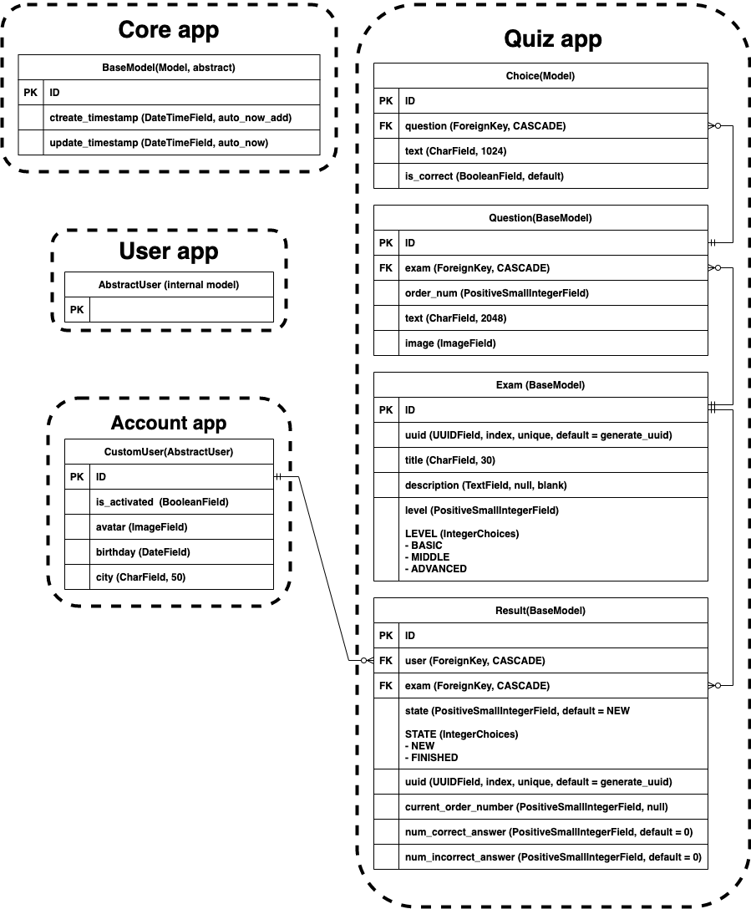

# Технические требования

### Web UI
-[x] Регистрация
  -[x] регистрация
  -[x] авторизация / аутентификация
  -[x] смена пароля
  -[x] сброс пароля
  -[x] профиль

- Возможности пользователя
  - прохождение любого теста
  - последовательно проходить вопросы теста (один за другим)
  - завершение отложенного теста
  - удалять отложенный тест
  - просмотр результатов

- После завершения теста
  - кол-ве привильных / не правильных ответов
  - процент правильных ответов

# Админ сайт
- [x] Управление пользователями
- Управление тестами
  -[x] изменить тест
  -[x] добавление нового теста
  -[x] удаление теста
  - валидация теста
    - [x] нельзя сохранить вопрос без указания правильного ответа
    - [x] нельзя сохранить вопрос в котором все ответы правильные
    - order_num - от 1 до N и увеличивается на 1
    - [x] кол-во вопросов находится в заданном диапазоне (от 3 до 100)

# Доп. требования к проекту
-[x] Проект должен быть выложен на GitHub
-[x] Наличие файла requirements.txt
-[x] venv
- DB --> PostgreSQL
  - миграция DB
-[x] bootstrap5
- API
  - unit tests
- кэширование + планировщик
- Упаковка в Docker и запуск на AWS
---
# DB Struct
